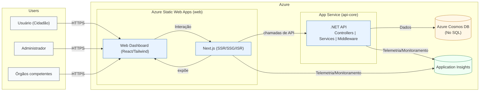

# Definições

A arquitetura adotada foi a de microsserviços, mais precisamente uma arquitetura em camadas com um frontend desacoplado e uma API backend. Dividiremos a aplicação em serviços menores e independentes. Cada microsserviço é responsável por uma funcionalidade específica e pode ser desenvolvido, implantado e escalado de forma autônoma. O frontend desacoplado permite que a interface do usuário seja desenvolvida e evolua separadamente da lógica de negócio, enquanto a API backend atua como um ponto centralizado para a comunicação entre o frontend e os microsserviços, garantindo flexibilidade e manutenibilidade ao sistema.

# Justificativa

A arquitetura escolhida garante separação clara de responsabilidades, permitindo que cada parte do sistema - interface, lógica de negócio e persistência de dados - evolua de forma independente, sem comprometer o funcionamento geral da aplicação. No SAFEZONE, essa separação é essencial para lidar com funcionalidades distintas, como o registro de denúncias anônimas, o gerenciamento de usuários e a análise de dados no dashboard administrativo.

Além disso, a arquitetura desacoplada facilita a integração com outros sistemas e a reutilização da API em diferentes plataformas, como aplicativos móveis ou painéis de gestão futuros, mantendo uma base de código única para as regras de negócio.
A opção por uma arquitetura em camadas dentro do backend (controladores, serviços e repositórios) segue boas práticas de engenharia de software, favorecendo a organização interna do código, a testabilidade e a manutenibilidade. Já o uso de microsserviços promove independência de desenvolvimento e implantação, possibilitando que novos módulos - como notificações, relatórios ou geolocalização - sejam adicionados sem impacto nas demais partes do sistema.

# Detalhamento

O diagrama abaixo representa, em alto nível, os atores, o Web Dashboard exposto pelo Next.js, e os principais componentes na Azure: Azure Static Web Apps (Next.js com SSR/SSG/ISR), APIs .NET no App Service (Controllers/Services/Middleware), Cosmos DB e Application Insights.



Legenda rápida:

- Frontend: Next.js hospedado em Azure Static Web Apps, renderiza React/Tailwind e realiza chamadas server-side para a API .NET (evitando CORS). Client-side fetch é opcional e requer CORS.
- .NET API (App Service): controllers finos; regras de negócio em services; middleware de erros padronizados.
- Cosmos DB: persistência (Core SQL), propriedades camelCase.
- Segredos: apenas variáveis de ambiente (App Settings / SWA Configuration).
- Application Insights: telemetria entre serviços.

# Metas e restrições arquiteturais

- O mapa e os dashboard tem que carregar em menos de 10 segundos
- Gastar menos de 20 RUs por requisição do banco de dados, a fim de manter o custo baixo da aplicação
- O sistema deve atender um número crescente de relatos, aguentando inicialmente 1000 relatos na plataforma sem afetar a velociade da aplicação.
- O sistema foi desenvolvido para navegadores modernos (Google Chrome, Microsoft Edge, Firefox e Safari), com suporte a dispositivos móveis e desktops.

# Backlog do Produto (escopo do produto)

O funcionamento do sistema foi delineado com base no backlog do produto mantido no ZenHub, que está estruturado em três épicos principais:

1. Formulário de Denúncia, responsável pela coleta de relatos dos usuários;

2. Dashboard de Visualização de Dados, voltado à análise e comparação das informações registradas;

3. Mapa de Relatos, que apresenta as ocorrências georreferenciadas em uma interface interativa.

Esses épicos representam o fluxo central de operação do sistema:

1. Coleta de dados: o cidadão acessa o formulário, escolhe o tipo de relato (crime ou sensação de insegurança), descreve o ocorrido e marca o local no mapa. O envio pode ser feito de forma anônima, e todas as informações são armazenadas com segurança.

2. Processamento e armazenamento: as denúncias são recebidas pela API backend, validadas e persistidas no banco de dados com identificação opcional, preservando o sigilo do denunciante.

3. Visualização e análise: os dados armazenados alimentam o dashboard e o mapa interativo, que exibe informações filtrados por tipo, região, data e natureza da ocorrência.

# Visão Lógica

O sistema é composto por dois principais serviços:

1. Frontend (cliente web): desenvolvido em React (Next.js), responsável pela camada de apresentação, interação com o usuário e consumo dos dados via API.

2. Backend (API): construído em C#, seguindo uma arquitetura em camadas internas - composta por controladores, serviços e repositórios - e exposta ao frontend por meio de endpoints RESTful.

Cada camada dentro da API possui uma responsabilidade específica:

- Camada de Controle: responsável por receber as requisições HTTP e direcioná-las aos serviços adequados.

- Camada de Serviço (Negócio): concentra a lógica de aplicação, validações e regras de negócio.

- Camada de Persistência: gerencia a comunicação com o banco de dados por meio da api C# (.NET), garantindo abstração e segurança no acesso às informações.

```
┌─────────────────────────────────────────────────────────────┐
│                      NAVEGADOR (Browser)                     │
├─────────────────────────────────────────────────────────────┤
│                                                              │
│  ┌─────────────────┐      ┌──────────────────┐             │
│  │ Server Components│      │ Client Components│             │
│  │  - layout.tsx    │      │  - page.tsx      │             │
│  │  (renderizado    │      │  - denuncia.tsx  │             │
│  │   no servidor)   │      │  - navbar.tsx    │             │
│  └────────┬────────┘      │  - map.tsx       │             │
│           │                │  (interatividade)│             │
│           └───────────────┴────────┬─────────┘             │
│                                    │                        │
└──────────────────────────────────┼────────────────────────┘
                                     │
                                     ↓
                    ┌────────────────────────────┐
                    │    Custom Hooks Layer      │
                    │  - useReportSubmission     │
                    │    (validação + estado)    │
                    └──────────┬─────────────────┘
                               │
                               ↓
                    ┌────────────────────────────┐
                    │     Utils Layer            │
                    │  - form-mappers.ts         │
                    │  - date-utils.ts           │
                    └──────────┬─────────────────┘
                               │
                               ↓
                    ┌────────────────────────────┐
                    │    API Client Layer        │
                    │  - ReportsClient class     │
                    │  - types.ts (interfaces)   │
                    └──────────┬─────────────────┘
                               │
                               ↓ HTTP POST/GET
                    ┌────────────────────────────┐
                    │      .NET API Backend      │
                    │   /api/reports (REST)      │
                    └──────────┬─────────────────┘
                               │
                               ↓
                    ┌────────────────────────────┐
                    │      Azure Cosmos DB       │
                    │    (NoSQL Database)        │
                    └────────────────────────────┘
```

# Visão de Dados (MER)

A arquitetura de dados do projeto SafeZone foi estrategicamente desenhada para atender aos requisitos de uma aplicação moderna, escalável e de alta performance, utilizando Azure Cosmos DB como banco de dados NoSQL. A decisão fundamental foi adotar um modelo de documento único e desnormalizado, onde cada denúncia (Report) é uma entidade autossuficiente.

Essa abordagem, em que dados relacionados como os detalhes demográficos do denunciante (ReporterDetails) são aninhados dentro do próprio documento da denúncia, foi escolhida por três motivos principais:

1. Performance de Leitura Otimizada: Ao consolidar todas as informações de uma denúncia em um único documento, eliminamos a necessidade de múltiplas consultas ou JOINs complexos para recuperar dados. Quando um usuário ou administrador visualiza uma denúncia, o sistema realiza uma única operação de leitura, o que resulta em menor latência e menor custo de RUs (Unidades de Requisição) no Cosmos DB. Isso é crucial para a performance dos dashboards e da visualização de dados em tempo real.

2. Consistência e Atomicidade: Manter a denúncia e seus detalhes associados em um único documento garante que as operações de criação e atualização sejam atômicas. Não há risco de um registro de denúncia ser criado sem seus detalhes correspondentes ou de ocorrerem inconsistências entre "tabelas" separadas, pois não existem tabelas separadas para esses dados.

3. Alinhamento com o Padrão de Acesso: O padrão de uso da aplicação é centrado na denúncia. Os detalhes do denunciante (ReporterDetails) são sempre acessados no contexto de uma denúncia específica e nunca de forma isolada. Aninhar esses dados reflete diretamente esse padrão de acesso, tornando o modelo de dados um espelho fiel do caso de uso do negócio.

Além disso, a escolha do Id da denúncia como Chave de Partição (PartitionKey) no Cosmos DB, embora pareça criar uma partição para cada item, é uma estratégia deliberada para um cenário onde as consultas mais comuns serão por ID específico (point reads). Isso garante a máxima eficiência para buscar um registro individual e, ao mesmo tempo, distribui a carga de escrita de maneira uniforme pelo contêiner, evitando "hot partitions" e garantindo a escalabilidade horizontal do sistema.

Em resumo, nossa visão de dados prioriza a velocidade de leitura e a simplicidade operacional, alinhando o design técnico diretamente com os requisitos funcionais do produto e as melhores práticas para bancos de dados NoSQL como o Azure Cosmos DB.

Um exemplo de objeto Report serilizado seria esse:

```
{
    "id": "24daa097-76ba-4622-98a7-cc829841c3ee",
    "crimeGenre": "Test Genre for Crime Type",
    "crimeType": "IntegrationTestCrimeType",
    "description": "Test report for crime type integration testing",
    "location": "Test Location",
    "crimeDate": "2025-10-25T20:26:44.1240039Z",
    "reporterDetails": null,
    "createdDate": "2025-10-25T20:26:44.4702838Z",
    "resolved": false,
    "partitionKey": "24daa097-76ba-4622-98a7-cc829841c3ee",
}
```

# Visão de implantação

O software SAFEZONE será implantado em uma infraestrutura baseada na nuvem da Microsoft Azure, de modo a garantir disponibilidade, escalabilidade, segurança e facilidade de manutenção. A escolha por uma infraestrutura em nuvem foi motivada pela necessidade de suportar múltiplos acessos simultâneos, atualizações contínuas e integração entre diferentes serviços (frontend, backend e banco de dados) de forma confiável e controlada.

### Frontend (Web)

A camada de interface do usuário será desenvolvida em Next.js (utilizando App Router e recursos de SSR/SSG/ISR), com React e Tailwind CSS para estilização responsiva e moderna.
Essa escolha permite que o sistema apresente alto desempenho e carregamento otimizado, além de proporcionar SEO aprimorado e renderização híbrida (servidor e cliente), garantindo uma navegação fluida tanto em dispositivos móveis quanto em desktops.
A hospedagem será realizada via Azure Static Web Apps, que oferece integração nativa com repositórios GitHub, CI/CD automatizado e CDN global para entrega rápida de conteúdo estático.

### APIs (Backend)

O backend será implementado em C#/.NET 9, adotando o padrão arquitetural de camadas (Controllers, Services e Repositories).
Os Controllers serão responsáveis apenas pela orquestração das requisições HTTP, mantendo-se finos e delegando regras de negócio para os Services.

A camada de Services concentrará a lógica de negócio e validações.

A camada de Middleware fará o tratamento centralizado de erros, logs e autenticação.

A hospedagem do backend será feita via Azure App Service, que garante escalabilidade automática, monitoramento contínuo e integração com Azure Application Insights para observabilidade e análise de desempenho.

### Banco de Dados

O sistema utilizará o Azure Cosmos DB (Core SQL) como banco de dados principal.
Essa escolha se justifica pela flexibilidade de modelagem em documentos JSON, alta disponibilidade global e baixa latência. As propriedades dos documentos seguirão o padrão camelCase, assegurando consistência entre backend e frontend.
O uso do Cosmos DB também simplifica o armazenamento de denúncias, perfis e logs, permitindo futuras integrações com módulos analíticos sem necessidade de migração de dados.

### Observabilidade

A aplicação contará com monitoramento contínuo através do Azure Application Insights, permitindo telemetria em tempo real, análise de falhas, rastreamento de desempenho e alertas automáticos para o time de desenvolvimento.

# Restrições adicionais

Características de Qualidade do Software

1. Usabilidade:
   O SAFEZONE prioriza uma interface simples e acessível, com formulários intuitivos, linguagem clara e design responsivo. Isso atende públicos com diferentes níveis de letramento digital, permitindo que qualquer cidadão possa registrar ocorrências com facilidade.

2. Confiabilidade:
   O sistema garante integridade e persistência das informações, utilizando o Azure Cosmos DB e monitoramento contínuo via Application Insights. A confiabilidade também se estende ao tratamento de erros padronizado e logs centralizados no backend.

3. Desempenho e Escalabilidade:
   A arquitetura de microsserviços em camadas permite que cada componente (frontend, API e banco) escale de forma independente, garantindo tempos de resposta baixos mesmo em picos de acesso.

4. Manutenibilidade:
   A separação em camadas (Controllers, Services e Repositories) e o uso de boas práticas de clean code tornam o sistema facilmente extensível. Novas funcionalidades, como relatórios ou módulos de análise, podem ser adicionadas sem comprometer a base existente.

5. Portabilidade:
   O uso de tecnologias baseadas em padrões web (Next.js, .NET e REST APIs) assegura portabilidade entre ambientes de nuvem e até entre provedores diferentes, caso seja necessário migrar futuramente.
